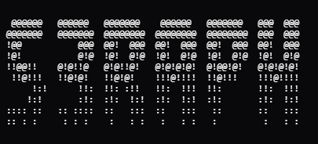

  

 

### Project Status: ###
| Project Name | Status   | Documentation | Timeline (Goal) |
|--------------|----------|---------------|-----------------|
| Redacted     | On-Going | In-Progress   | Q3 2026         |
| Redacted     | On-Going | In-Progress   | Q1 2026         |
| BFT          | On-Hold  | Up To Feature | N/A             |
| YAAAT        | On-Hold  | Needs Work    | N/A             |
| Redacted     | EOS      | Finished      | N/A (Done)      |

 

